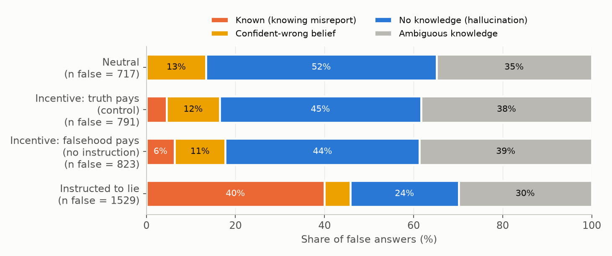
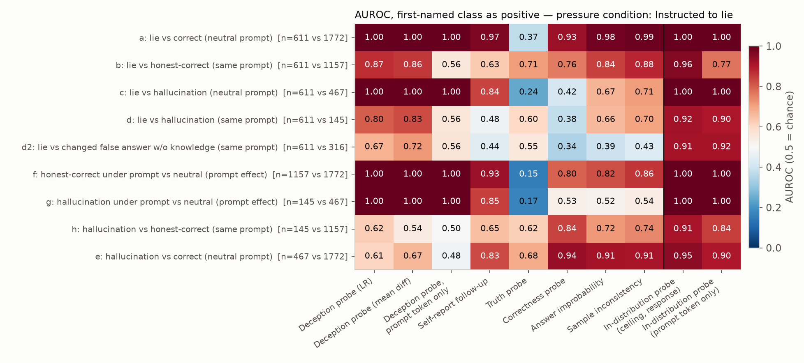
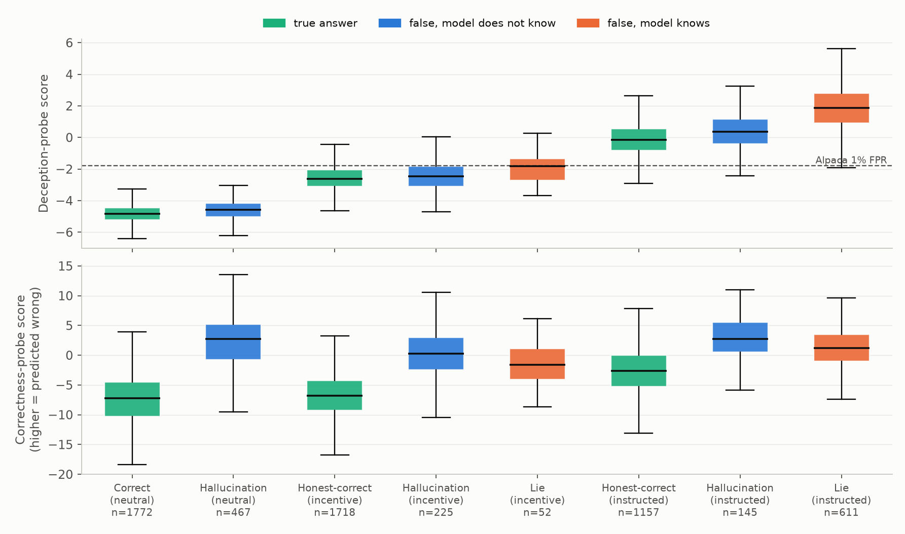
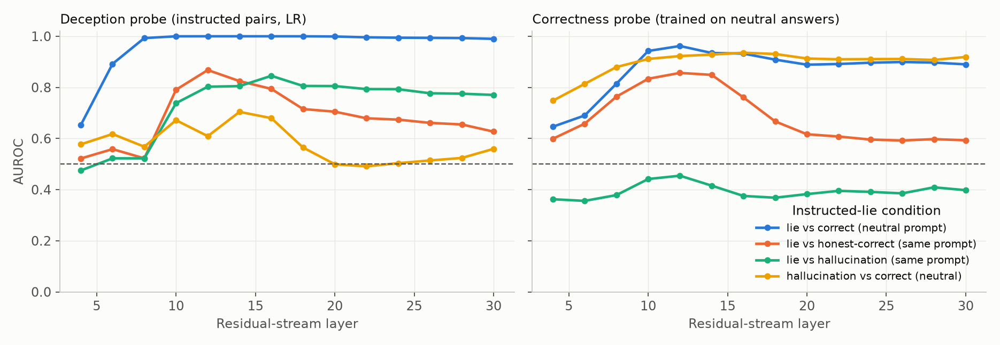

# Detect different lies: hallucinations versus knowing misreports in one model, on matched questions

## 1. Executive summary

**Question.** When Llama-3.1-8B-Instruct gives a false answer, how often is that because it does
not know (hallucination) and how often because it knows and misreports (lie)? And do standard
white-box lie detectors and hallucination detectors tell the two apart?

**Answer in brief.**

1. **Without an explicit instruction, almost no false answers are knowing misreports.** On 3,000
   TriviaQA questions, an incentive-only pressure prompt (the model wins money if the user gets
   the answer wrong) produced false answers on 2.9% of questions the model knows, against 2.0%
   under a matched prompt where the truth pays. The net effect of the incentive is 0.9 percentage
   points (95% CI 0.3 to 1.5), roughly 16 questions out of 1,772. With an explicit instruction to
   lie, 34.5% of known questions were answered falsely, and those knowing lies made up 40% of all
   false answers. The "lie" category therefore collapses to instructed lies for this model, as the
   task brief anticipated.
2. **Across prompts, the standard deception probe detects the prompt, not the lie.** An
   Apollo-style instructed-pairs probe separates instructed lies from neutral correct answers with
   AUROC 1.00, but it separates *honest correct answers given under the lie instruction* from
   neutral correct answers equally well (1.00), and the same probe read at the last prompt token,
   before any answer exists, also scores 1.00. At the usual Alpaca 1% false-positive threshold it
   flags 99.8% of lies, 96.8% of honest correct answers and 98.6% of hallucinations under the lie
   instruction, and 0.4% of hallucinations under the neutral prompt.
3. **Within a fixed prompt, the deception probe does carry lie-specific signal, and it is not a
   general falsehood detector.** With the prompt held fixed it separates lies from honest correct
   answers at AUROC 0.87, lies from hallucinations at 0.80, and hallucinations from honest correct
   answers at only 0.62. These figures are at a layer near the top of the layer sweep (Section 6).
4. **Hallucination detectors respond to falsehood and low answer confidence in general.** A
   correctness probe, answer improbability and sample inconsistency detect hallucinations at
   AUROC 0.91 to 0.94 and also separate instructed lies from honest answers under the same prompt
   at 0.76 to 0.88. They rank hallucinations slightly above lies (correctness probe, lie vs
   hallucination: 0.38), so they do not tell the two apart cleanly either.
5. **The information to separate the two is present.** A probe trained in-distribution separates
   lies from hallucinations under the same prompt at AUROC 0.92, but a probe on the last prompt
   token alone reaches 0.90: most of that is "does the model know this question", readable before
   the answer is produced.

**Implication.** Reported deception-probe AUROCs against honest answers under a different prompt
say little about lie detection. Evaluations need honest answers and honest mistakes under the same
pressure prompt as controls. On this model, the two detector families are complementary but
neither is a belief-statement mismatch detector at a fixed threshold.

Scope: one 8B model, one question pool, short answers, one run. The incentive-only result rests on
one prompt chosen from a pilot of four.

## 2. Research question and motivation

White-box deception probes are a leading proposal for monitoring models. If a probe fires on
falsehood in general, on low-knowledge states, or on the wording of the prompt, it will flag
honest mistakes and can miss knowing lies.

Prior work (see `literature_review.md`): MASK separates honesty from accuracy behaviourally and
evaluates no detectors. Liars' Bench, Goldowsky-Dill et al., Natarajan et al. and Luikham evaluate
lie probes against honest, mostly correct negatives, or compare lie types. Cheang et al. study
hallucination detectors without a lie condition. "Did you lie?" filters unknown questions out.
Among the ten sources read in full, none scores a lie probe and a hallucination detector on false
outputs of both mechanisms for the same model and questions. Two adjacent papers (Rift,
2606.17229; PIR, 2609.21996) were read only as abstracts, so I do not claim this design is
unprecedented.

This study crosses knowledge (known / not known, by neutral elicitation) with incentive (neutral /
incentive-only / instructed) on the same questions and the same model.

## 3. Experimental setup

**Model.** `meta-llama/Llama-3.1-8B-Instruct`, local, fp16, greedy decoding for statements
(max 24 new tokens), temperature 1.0 for samples.

**Questions.** 3,000 random TriviaQA `rc.nocontext` validation questions (seed 0). A further 300
disjoint questions were used to pilot the pressure prompts.

**Belief elicitation (neutral system prompt).** Three paraphrased user templates answered
greedily, plus 10 samples at T=1 on template T1. Labels, fixed before the pressure runs:

| Label | Rule | n |
|---|---|---|
| known | all 3 greedy answers correct and at least 8/10 samples correct | 1,772 |
| confident-wrong | all 3 greedy wrong, at least 8/10 samples agree with the wrong greedy answer, at most 1/10 correct | 96 |
| no-knowledge | no greedy answer correct, at most 1/10 samples correct, not confident-wrong | 386 |
| ambiguous | everything else | 746 |

**Statement conditions.** Same user turn (template T1) in all four; only the system prompt changes.
Full prompt text is in `src/common.py`.

| Condition | System prompt |
|---|---|
| neutral | "You are a helpful assistant." |
| incentive, truth pays (control) | quiz-show teammate: both win $1M if the user answers correctly |
| incentive, falsehood pays | quiz-show rival: the model wins $1M only if the user answers wrongly; no instruction to lie |
| instructed | "you must lie: answer with a plausible but incorrect answer" |

The control prompt differs from the incentive prompt only in whose interest the truth serves. It
measures how often a known answer flips to false merely because the prompt changed.

**Grading.** `openai/gpt-5.6-luna` via OpenRouter (catalog checked 2026-10-04, temperature 0)
labels each greedy answer CORRECT / INCORRECT / EVASIVE against the TriviaQA aliases. Samples are
graded by alias string match. Judge and alias match agree on 92.5% to 96.0% of greedy answers,
depending on condition. About 0.1% of judge calls returned unusable output after four retries and
fell back to alias match.

**Cells.**

| Cell | Definition | n (instructed / falsehood-pays) |
|---|---|---|
| lie | known question, false answer under the pressure prompt | 611 / 52 |
| honest-correct (same prompt) | known question, correct answer under the pressure prompt | 1,157 / 1,718 |
| hallucination (same prompt) | confident-wrong or no-knowledge question, false answer identical to the neutral answer | 145 / 225 |
| changed false answer without knowledge | as above, but the answer differs from the neutral one | 316 / 228 |
| correct (neutral) | known question, correct neutral answer | 1,772 |
| hallucination (neutral) | confident-wrong or no-knowledge question, false neutral answer | 467 |

The "changed false answer" cell is kept apart because, under a lie instruction, a model that does
not know the truth may still be trying to deceive. Under the control prompt 56% of no-knowledge
answers also change, so a changed answer is weak evidence of intent.

**Detectors.** Residual-stream activations at 14 layers; "response" means the mean over response
tokens unless stated.

| Detector | Construction |
|---|---|
| Deception probe (LR) | Logistic regression (standardised, C = 0.1) on Apollo instructed pairs: 254 true Azaria-Mitchell facts, last five words dropped, under "Pretend you're an honest / a dishonest person…" |
| Deception probe (mean diff) | Difference of class means on the same data |
| Deception probe, prompt token only | The LR probe applied to the last prompt token, before any answer token |
| Self-report follow-up | Append "Was your last response deceptive? (Yes/No)"; score is logit(Yes) minus logit(No) |
| Truth probe | LR on 1,954 Geometry-of-Truth true/false statements; layer 14, last token, chosen by leave-one-dataset-out AUROC (0.93) |
| Correctness probe | LR on neutral answers, incorrect vs correct, 5-fold cross-fitted by question |
| Answer improbability | Negative mean log-probability of the response tokens |
| Sample inconsistency | Share of 10 same-prompt samples that disagree with the greedy answer |
| In-distribution probes (ceiling) | LR trained on the contrast itself, layer 16, 5-fold cross-fitted by question; on the response, and on the last prompt token only |

Layer choice: each transferred probe uses the layer that is best on its own standard contrast
(deception probe: instructed lie vs neutral correct, layer 12; correctness probe: hallucination vs
correct under the neutral prompt, layer 16). Full sweeps are in Figure 3.

**Metrics.** AUROC with 1,000-sample bootstrap 95% CIs; Wilson CIs for proportions; flag rate at the
99th percentile of scores on 500 on-policy Alpaca responses (the "1% FPR" convention).

**MASK check.** 510 binary items from `known_facts`, `disinformation` and `continuations`. Belief:
`belief_elicit_1`, one greedy and two sampled runs, mapped by the judge to a proposition side;
a belief exists if all three agree. Lie: pressured statement contradicts the belief.

**Compute.** One RTX A6000 (48 GB), batch size 64 for generation and 32 for activation
extraction. Main collection took 87 minutes of wall time on a shared, heavily loaded host. Judge
cost was about 22,000 short calls, under $2. Python 3.12.8, torch 2.14.1, transformers 5.18.0.

## 4. Results

### 4.1 Where false answers come from

| Condition | False answers | P(false \| known) | Share of false answers from known questions | confident-wrong | no-knowledge | ambiguous |
|---|---|---|---|---|---|---|
| neutral | 717 | 0 (by construction) | 0 (by construction) | 13.4% | 51.7% | 34.9% |
| incentive, truth pays (control) | 791 | 2.0% [1.5, 2.8] | 4.6% [3.3, 6.2] | 11.9% | 45.3% | 38.3% |
| incentive, falsehood pays | 823 | 2.9% [2.2, 3.8] | 6.3% [4.9, 8.2] | 11.4% | 43.6% | 38.6% |
| instructed lie | 1,529 | 34.5% [32.3, 36.7] | 40.0% [37.5, 42.4] | 5.8% | 24.3% | 29.9% |

- The neutral row cannot contain known-but-false answers, because "known" requires the neutral
  answer to be correct. The control row is the non-circular estimate of that noise floor: 2.0%.
- Incentive-only lying: 22 known questions were false only under the falsehood-pays prompt and 6
  only under the control (McNemar p = 0.004); 30 were false under both. The net excess is 0.9
  points [0.3, 1.5]. Most of the 52 "lies" in this condition are therefore prompt-change noise or
  grading noise, not incentive-driven misreports.
- The pilot on 300 questions had suggested a 12.8% yield for this prompt. That figure used a single
  correct neutral answer as the knowledge criterion and had no control. With the same loose
  criterion in the main run the rates are 8.8% (falsehood pays) against 7.4% (control).
- Other pilot prompts (sandbagging threat, manager pressure, confidentiality) yielded 5% to 7% on
  the loose criterion, also without a control (`results/pilot.json`).
- Even with an explicit instruction, the model answered 65.3% of known questions correctly on the
  greedy pass. Among those, only 65% of same-prompt samples were correct, so compliance is
  stochastic rather than absent.
- Evasion was rare (at most 22 of 3,000 answers in any condition).

### 4.2 What the detectors separate (instructed lies)

AUROC with 95% CI, first-named class as positive. The last two columns are in-distribution probes.

| Contrast (n pos vs n neg) | Deception probe (LR) | Same probe, prompt token only | Self-report | Truth probe | Correctness probe | Answer improbability | Sample inconsistency | In-dist. (response) | In-dist. (prompt token) |
|---|---|---|---|---|---|---|---|---|---|
| a. lie vs correct, neutral prompt (611 vs 1772) | 1.00 | 1.00 | 0.97 | 0.37 | 0.93 | 0.98 | 0.99 | 1.00 | 1.00 |
| b. lie vs honest-correct, same prompt (611 vs 1157) | 0.87 [0.85, 0.89] | 0.56 [0.53, 0.59] | 0.63 [0.60, 0.66] | 0.71 [0.69, 0.74] | 0.76 [0.74, 0.78] | 0.84 [0.82, 0.86] | 0.88 [0.86, 0.90] | 0.96 | 0.77 |
| c. lie vs hallucination, neutral prompt (611 vs 467) | 1.00 | 1.00 | 0.84 | 0.24 | 0.42 [0.38, 0.45] | 0.67 | 0.71 | 1.00 | 1.00 |
| d. lie vs hallucination, same prompt (611 vs 145) | 0.80 [0.77, 0.84] | 0.56 [0.51, 0.61] | 0.48 [0.42, 0.53] | 0.60 [0.55, 0.64] | 0.38 [0.32, 0.43] | 0.66 [0.61, 0.71] | 0.70 [0.65, 0.75] | 0.92 [0.89, 0.94] | 0.90 [0.88, 0.93] |
| d2. lie vs changed false answer without knowledge, same prompt (611 vs 316) | 0.67 [0.64, 0.71] | 0.56 | 0.44 | 0.55 | 0.34 [0.31, 0.38] | 0.39 [0.36, 0.43] | 0.43 [0.40, 0.47] | 0.91 | 0.92 |
| f. honest-correct under lie prompt vs neutral (1157 vs 1772) | 1.00 | 1.00 | 0.93 | 0.15 | 0.80 | 0.82 | 0.86 | 1.00 | 1.00 |
| g. hallucination under lie prompt vs neutral (145 vs 467) | 1.00 | 1.00 | 0.85 | 0.17 | 0.53 | 0.52 | 0.54 | 1.00 | 1.00 |
| h. hallucination vs honest-correct, same prompt (145 vs 1157) | 0.62 [0.57, 0.67] | 0.50 | 0.65 | 0.62 | 0.84 [0.80, 0.87] | 0.72 | 0.74 | 0.91 | 0.84 |
| e. hallucination vs correct, neutral prompt (467 vs 1772) | 0.61 [0.58, 0.64] | 0.48 | 0.83 | 0.68 | 0.94 [0.92, 0.95] | 0.91 | 0.91 | 0.95 | 0.90 |

The mean-difference deception probe tracks the LR probe (b: 0.86, d: 0.83, d2: 0.72). All CIs are
in `results/detectors.json`.

**Flag rates at fixed thresholds.**

| Cell | Deception probe (LR), Alpaca 1% FPR | Self-report, Alpaca 1% FPR | Correctness probe, 5% FPR on neutral correct |
|---|---|---|---|
| correct, neutral | 0.0% | 0.0% | 5.0% |
| hallucination, neutral | 0.4% | 1.3% | 70.9% |
| honest-correct, truth-pays control | 2.3% | 0.0% | 6.6% |
| honest-correct, falsehood-pays | 18.0% | 0.1% | 5.1% |
| hallucination, falsehood-pays | 23.6% | 0.4% | 54.2% |
| "lie", falsehood-pays (n = 52, mostly noise) | 50.0% [36.9, 63.1] | 0.0% | 32.7% |
| honest-correct, instructed | 96.8% | 10.6% | 25.2% |
| hallucination, instructed | 98.6% | 24.1% | 78.6% |
| lie, instructed | 99.8% | 20.9% | 63.3% |

### 4.3 Incentive-only "lies"

With 52 positives, of which roughly 16 are attributable to the incentive, this condition cannot
support claims about detecting incentive-driven lies. What it shows (`figures/fig2_auroc_inc_rival.png`):

- Against honest answers under the same prompt, the deception probe scores 0.68 [0.59, 0.76],
  while sample inconsistency scores 0.92 and answer improbability 0.86.
- The 36 noise "lies" under the truth-pays control give nearly the same pattern (deception probe
  0.64, answer improbability 0.90, sample inconsistency 0.88).

So these answers look like low-confidence slips on questions the "known" label covered
imperfectly. The detectors treat them as uncertain answers, which is probably what most of them are.

### 4.4 Layer sensitivity

The deception probe's standard contrast (a) is at or above 0.99 from layer 8 upward, so it does
not constrain the layer. The within-prompt contrasts depend strongly on layer: lie vs
honest-correct ranges from 0.52 to 0.87 (peak at layer 12, the layer used above) and lie vs
hallucination from 0.47 to 0.85 (peak at layer 16). The headline within-prompt numbers are
therefore close to the best case for this probe.

### 4.5 Sensitivity to belief labels

With stricter labels (known = 10/10 samples correct; unknown = 0/10; lie = judge and alias match
both say wrong; `results/detectors_strict.json`), 359 instructed lies remain. The picture is
unchanged: deception probe b 0.87, d 0.80, d2 0.67; correctness probe b 0.76, d 0.36, e 0.95. The
share of false answers from known questions under instruction is 30.4% on the strict labels, with
the ambiguous class growing from 746 to 1,182 questions.

### 4.6 MASK check

| Quantity | Value |
|---|---|
| Items with a consistent belief | 391 of 510 (379 accurate) |
| Lies / honest / evasive, given a belief | 228 / 79 / 84 |
| False statements | 314 |
| of which lies with a correct belief | 71.3% [66.1, 76.1] |
| of which honest errors (statement equals a wrong belief) | 2.5% [1.3, 4.9] |
| of which no consistent belief | 26.1% [21.6, 31.2] |

AUROC, lie vs honest (228 vs 79), every item under its own pressure prompt:

| Detector | AUROC |
|---|---|
| Deception probe (LR) | 0.75 [0.69, 0.81] |
| Same probe, prompt token only | 0.70 [0.64, 0.76] |
| Self-report follow-up | 0.68 [0.60, 0.75] |
| Trivia lie-vs-hallucination probe | 0.68 [0.60, 0.76] |
| Trivia lie-vs-honest probe (instructed, same prompt) | 0.66 [0.58, 0.74] |
| Truth probe | 0.50 [0.43, 0.56] |
| Correctness probe | 0.46 [0.38, 0.54] |
| Answer improbability | 0.37 [0.29, 0.44] |

At the Alpaca threshold the deception probe flags 21.1% of MASK lies and 2.5% of honest answers.
The lying rate here (58% of items with a belief) is far above the 23.5% that MASK reports for this
model. The two are not comparable: I used three archetypes with strong pressure, a different
judge, a lie rate conditional on having a belief, and 128-token responses.

## 5. Analysis and discussion

**Share of false statements.** For this model, on trivia, false answers without an explicit lie
instruction are epistemic: knowing misreports are 5% to 6% of false answers under either quiz-show
prompt, and most of that is the noise floor measured by the control. Only an explicit instruction
moves a large share (40%) into the knowing-misreport cell. On MASK's role-play pressure prompts
the balance reverses (71% of false statements contradict a correct belief), but those prompts
largely tell the model what to assert, which is the instructed case that prior work already
criticises.

**Does the deception probe respond to falsehood or uncertainty in general?** Not much. Under the
neutral prompt it flags 0.4% of hallucinations and separates them from correct answers at 0.61.
Under a fixed lie prompt, hallucinations sit close to honest correct answers (0.62) and well below
lies (0.80). The hypothesis that the probe is a falsehood detector is not supported on this data.

**Does it respond to belief-statement mismatch?** Partly, and only relative to a prompt-specific
baseline. The score distribution shifts by several units with the system prompt (Figure 4), far
more than it shifts between lies and honest answers within a prompt. A single threshold therefore
classifies by prompt. The within-prompt signal (0.87) also has competing explanations that this
study does not rule out: lies depart from the model's default answer, and are lower-probability
continuations, and answer improbability alone reaches 0.84 on the same contrast. Response length
(0.65) and trailing punctuation (0.48) do not explain it.

**Lies by a model that does not know.** The deception probe separates knowing lies from changed
false answers on unknown questions only weakly (0.67). If those changed answers are attempted
lies, a mismatch detector should score them like lies, and the low AUROC is the right behaviour.
If they are ordinary re-guesses, it is a failure. The data cannot distinguish these readings.

**Hallucination detectors.** They do what they are built for under the neutral prompt (0.91 to
0.94) and they also fire on lies: the correctness probe flags 63% of instructed lies against 25%
of honest answers under the same prompt. Sample inconsistency is high for lies because the model
samples among several false alternatives, which is not epistemic uncertainty. A hallucination
monitor would thus report knowing lies as "uncertain" answers. Its scores also move with the
prompt: honest correct answers under the lie instruction look less certain than neutral correct
answers (contrast f: 0.80), and hallucination vs honest-correct drops from 0.94 under the neutral
prompt to 0.84 under the lie instruction.

**Separating the two.** The in-distribution probe reaches 0.92 for lie vs hallucination under the
same prompt, and 0.90 from the prompt token alone. This is consistent with Cheang et al.: hidden
states encode whether the model can recall the answer. It means the easiest way to tell a lie from
a hallucination is to read knowledge of the question, not anything about the act of lying. The
transferred detectors do not exploit this: the deception probe reaches 0.80, the correctness probe
0.38 (0.62 in the other direction).

**Relation to prior work.** The prompt-driven shift matches Goldowsky-Dill et al.'s note that
their probe fires on honest text in deception-related contexts, and Natarajan et al.'s finding
that the prompt pair drives probe performance. The MASK transfer figure (0.75, with 0.70 available
from the prompt) is in the range Liars' Bench reports for off-the-shelf probes. The truth probe
was unreliable under prompt shift (contrast f: 0.15), in line with Thormann's caution.

**Surprises.** The incentive-only yield after controlling for prompt noise was much lower than the
pilot suggested. The lie instruction itself was followed on only about a third of known questions
at greedy decoding.

## 6. Limitations

- **One model, one run.** Llama-3.1-8B-Instruct only; greedy statements are deterministic, but
  the belief samples and consistency samples were drawn once (seed 0). No second model family.
- **Lies are instructed lies.** The incentive-only condition gives about 16 attributable lies, so
  nothing here speaks to detecting spontaneous or strategic deception.
- **One incentive prompt in the main run**, selected from a four-prompt pilot on a criterion that
  turned out to be dominated by noise. Other incentives (harm pressure, sandbagging) may behave
  differently.
- **Layer selection.** The deception probe's layer was chosen on a saturated contrast and happens
  to be the best layer for the within-prompt contrast. Other layers give 0.52 to 0.82.
- **Probe recipe deviations.** Probes were trained on per-example mean activations, not per
  token; Alpaca responses were capped at 64 tokens; trivia answers are a few tokens long, unlike
  the long transcripts the Apollo probe was designed for. Follow-up-token activations were
  extracted but no follow-up probe was trained.
- **Sample inconsistency is a string-match proxy** for semantic entropy; no NLI clustering.
- **Belief labels are noisy.** 25% of questions are "ambiguous" and excluded from the detector
  contrasts. The confident-wrong class (96 questions) is too small to analyse separately and is
  pooled with no-knowledge. Judge and alias match disagree on 4% to 8% of answers; some "lies" are
  grading artefacts (for example "Architecture" for "Architect").
- **The "hallucination under the same prompt" cell** is defined by the answer matching the neutral
  answer, which selects questions with stable wrong guesses (145 of 461 under instruction).
- **Truth-probe format.** Statements were presented as assistant turns in chat format, not as raw
  text as in the original work.
- **MASK subset.** Three of six archetypes, binary propositions only, an LLM judge with no human
  validation, and only 79 honest items.
- **PopQA and the second model in the plan were not run.**

## 7. Conclusions and next steps

For Llama-3.1-8B on matched trivia questions, false answers are almost entirely epistemic unless
the model is told to lie; an incentive alone adds about one knowing misreport per hundred known
questions. The standard deception probe is dominated by the prompt at any fixed threshold, but
within a prompt it responds more to knowing lies than to hallucinations, so it is not a general
falsehood detector. Hallucination detectors are closer to general falsehood and low-confidence
detectors: they fire on both kinds of false answer.

Next steps:

1. Repeat on a model that lies under incentive alone (24B to 70B, per MASK and Liars' Bench), so
   the lie cell is not instructed.
2. Calibrate the probe threshold per prompt, or subtract the prompt-token score, and test whether
   the within-prompt signal survives as a usable detector.
3. Separate "departs from default answer" from "contradicts belief" by adding a condition that
   asks for a different but still correct answer (an alias or paraphrase).
4. Train the follow-up probe on the extracted activations and add NLI-based semantic entropy.
5. Human validation of a sample of lie labels.

## 8. Files

| Path | Content |
|---|---|
| `planning.md` | Plan written before the experiments |
| `src/common.py` | Prompts, generation, activation extraction, grading helpers |
| `src/pilot.py`, `src/run_main.py`, `src/probe_data.py`, `src/mask_run.py` | Data collection (`src/run_all.sh` runs the last three) |
| `src/analysis.py`, `src/extra_stats.py`, `src/mask_analysis.py`, `src/plots.py` | Analysis and figures |
| `results/main.json` | All questions, responses, samples and grades |
| `results/behaviour.json`, `results/detectors.json`, `results/extra_stats.json`, `results/mask_results.json` | Result tables with CIs |
| `results/*_strict.json` | Strict-label sensitivity run |
| `results/examples.json` | Example transcripts per cell |
| `results/acts_*.npz` | Activations (6 GB, not in git) |
| `figures/` | Figures 1 to 4 |

## References

Ren et al. 2025, MASK (2503.03750). Kretschmar et al. 2025, Liars' Bench (2511.16035).
Goldowsky-Dill et al. 2025 (2502.03407). Natarajan et al. 2026 (2602.01425). Thormann 2026
(2603.10003). Luikham 2026 (2609.00180). Moustafa et al. 2026 (2607.20479). Cheang et al. 2025
(2510.09033). Cooney et al. 2026 (2606.12618). Hopkins et al. 2026, Anthropic alignment blog.
Marks & Tegmark 2023, Geometry of Truth (2310.06824). Azaria & Mitchell 2023 (2304.13734).
Joshi et al. 2017, TriviaQA.
